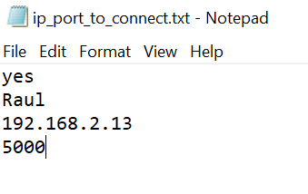

# Simple Multiplayer Game using pygame and Raycasting Algorithm (pseudo-3D)
### Created using python (3.8.2) and pygame library (1.9.6): https://www.pygame.org/

# Features
* Textured Raycasting with projectile and player sprite casting
* Threaded sockets for data handling to decouple it from pygame's main loop
* Scoreboard with kills/deaths
* Darkening of walls depending on the distance from the player
* Deathmatch style with random spawn after death
* Minimap
* Server message to show killer and victim nicknames to everyone connected

### Website I used to learn about the algorithm used for the raycasting part (in C++): 
### https://lodev.org/cgtutor/raycasting.html
## Usage:
1. Download all the files
2. If you want to just test as a single player, just run **client.py**
3. If you want to play multiplayer, edit first **ip_port_to_connect.txt**
4. Change the first line in **ip_port_to_connect.txt** from **no** to **yes**
5. Second line in  **ip_port_to_connect.txt** is your nickname
6. Check your IP within your **router network** and change the third line in **ip_port_to_connect.txt** to yours
7. Fourth line in **ip_port_to_connect.txt** is the port to connect. Don't change this as it is hardcoded on the server part for now
8. Run **server.py** before any client connection and let it stay open
9. Run as many **client.py** you want (I only tested with 3 on same computer as it affects fps ingame)
10. If you run clients from another computer, remember to change the text file and put the IP address of the machine that is running the server
11. If you want to connect over the internet, make sure the machine running the server has port forwarded port 5000 and let the IP in the client's txt file be the **external IP** of the server

Example:

    
* Controls:
    * **W A S D:** move the player
    * **Right, Left Arrows:** turn the player camera
    * **Mouse move:** moves the camera horizontally
    * **Mouse Left click or spacebar:** Shoots a projectile
    * **Right click:** toggle mouse cursor visibility
